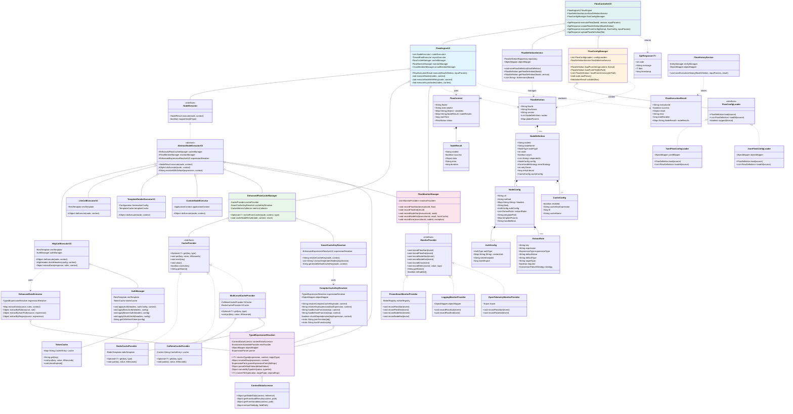

# flow

```mermaid
classDiagram
    %% ==================== 核心模型层 ====================
    class FlowDefinition {
        +String flowId
        +String flowName
        +String version
        +List~NodeDefinition~ nodes
        +Map globalParams
    }
    
    class NodeDefinition {
        +String nodeId
        +String nodeName
        +NodeType nodeType
        +int order
        +boolean async
        +List~String~ dependsOn
        +NodeConfig config
        +ErrorHandleStrategy errorStrategy
        +int retryTimes
        +long retryInterval
        +CacheConfig cacheConfig
    }
    
    class NodeConfig {
        +String url
        +String method
        +Map~String,String~ headers
        +String body
        +AuthConfig authConfig
        +List~ExtractRule~ extractRules
        +String templatePath
        +Map templateParams
        +String handlerBean
    }
    
    class ExtractRule {
        +String key
        +String expression
        +ExpressionType expressionType
        +String defaultValue
        +String defaultType
        +String targetType
        +boolean required
        +ConversionFailureStrategy strategy
    }
    
    class CacheConfig {
        +boolean enabled
        +String cacheKeyExpression
        +long ttl
        +String cacheName
    }
    
    class AuthConfig {
        +AuthType authType
        +Map~String,String~ credentials
        +String tokenEndpoint
        +long tokenExpire
    }
    
    class FlowContext {
        +String flowId
        +String executionId
        +Map~String,Object~ variables
        +Map~String,NodeResult~ nodeResults
        +long startTime
        +FlowStatus status
    }
    
    class NodeResult {
        +String nodeId
        +boolean success
        +Object data
        +String error
        +long duration
    }
    
    class FlowExecutionResult {
        +String executionId
        +boolean success
        +Object result
        +String error
        +long totalDuration
        +Map~String,NodeResult~ nodeResults
    }
    
    %% ==================== 配置加载层 ====================
    class FlowConfigManager {
        -List~FlowConfigLoader~ configLoaders
        -FlowDefinitionService flowDefinitionService
        +FlowDefinition loadFromString(content, format)
        +FlowDefinition loadFromFile(filePath)
        +List~FlowDefinition~ loadFromDirectory(dirPath)
        +void autoLoadFlows()
        +ValidationResult validate(flow)
    }
    
    class FlowConfigLoader {
        <<interface>>
        +FlowDefinition load(source)
        +List~FlowDefinition~ loadAll(source)
        +boolean support(format)
    }
    
    class YamlFlowConfigLoader {
        -ObjectMapper yamlMapper
        +FlowDefinition load(source)
        +List~FlowDefinition~ loadAll(source)
    }
    
    class JsonFlowConfigLoader {
        -ObjectMapper objectMapper
        +FlowDefinition load(source)
        +List~FlowDefinition~ loadAll(source)
    }
    
    %% ==================== 执行引擎层 ====================
    class FlowEngineV2 {
        -List~NodeExecutor~ nodeExecutors
        -ThreadPoolExecutor asyncExecutor
        -FlowCacheManager cacheManager
        -FlowMonitorManager monitorManager
        -CircuitBreakerManager circuitBreakerManager
        +FlowExecutionResult execute(flowDefinition, inputParams)
        -void executeNodes(nodes, context)
        -void executeNodeWithRetry(node, context)
        -void executeAsyncNodes(nodes, context)
    }
    
    class NodeExecutor {
        <<interface>>
        +NodeResult execute(node, context)
        +boolean support(nodeType)
    }
    
    class AbstractNodeExecutorV2 {
        <<abstract>>
        #EnhancedFlowCacheManager cacheManager
        #FlowMonitorManager monitorManager
        #EnhancedExpressionResolverV2 expressionResolver
        +NodeResult execute(node, context)
        #Object doExecute(node, context)*
        #String resolveWithDefault(expression, context)
    }
    
    class HttpCallExecutorV2 {
        -RestTemplate restTemplate
        -AuthManager authManager
        #Object doExecute(node, context)
        -HttpHeaders buildHeaders(config, context)
        -Object extractData(response, rules, context)
    }
    
    class LlmCallExecutorV2 {
        -RestTemplate restTemplate
        #Object doExecute(node, context)
    }
    
    class TemplateRenderExecutorV2 {
        -Configuration freemarkerConfig
        -TemplateCache templateCache
        #Object doExecute(node, context)
    }
    
    class CustomNodeExecutor {
        -ApplicationContext applicationContext
        #Object doExecute(node, context)
    }
    
    %% ==================== 表达式解析层 ====================
    class TypedExpressionResolver {
        -ContextDataAccessor contextDataAccessor
        -EnvironmentVariableProvider envProvider
        -ObjectMapper objectMapper
        -ExpressionParser parser
        +~T~ resolveTyped(expression, context, targetType)
        -Object resolveRaw(expression, context)
        -ExpressionParts parseExpressionParts(fullExpr)
        -Object parseDefaultValue(defaultValue)
        -Object convertByTypeHint(value, typeHint)
        -~T~ convertToType(value, targetType, originalExpr)
    }
    
    class ContextDataAccessor {
        +Object getNodeData(context, reference)
        -Object getFromNodeResults(context, path)
        -Object getFromVariables(context, path)
        -Object extractField(obj, fieldPath)
    }
    
    class EnhancedDataExtractor {
        -TypedExpressionResolver expressionResolver
        +Map extractData(source, rules, context)
        -Object extractByRule(source, rule)
        -Object extractByJsonPath(source, expression)
        -Object extractByRegex(source, expression)
    }
    
    %% ==================== 缓存层(解耦) ====================
    class CacheProvider {
        <<interface>>
        +Optional~T~ get(key, type)
        +void put(key, value, ttlSeconds)
        +void evict(key)
        +void clear()
        +boolean exists(key)
        +String getName()
    }
    
    class RedisCacheProvider {
        -RedisTemplate redisTemplate
        +Optional~T~ get(key, type)
        +void put(key, value, ttlSeconds)
    }
    
    class CaffeineCacheProvider {
        -Cache~String,CacheEntry~ cache
        +Optional~T~ get(key, type)
        +void put(key, value, ttlSeconds)
    }
    
    class MultiLevelCacheProvider {
        -CaffeineCacheProvider l1Cache
        -RedisCacheProvider l2Cache
        +Optional~T~ get(key, type)
        +void put(key, value, ttlSeconds)
    }
    
    class EnhancedFlowCacheManager {
        -CacheProvider cacheProvider
        -SmartCacheKeyResolver cacheKeyResolver
        -CacheMetricsCollector metricsCollector
        +Optional~T~ tryGetFromCache(node, context, type)
        +void cacheNodeResult(node, context, result)
    }
    
    class SmartCacheKeyResolver {
        -EnhancedExpressionResolverV2 expressionResolver
        +String resolveCacheKey(node, context)
        -List~String~ extractDependentNodes(expression)
        -String generateDefaultCacheKey(node, context)
    }
    
    class ComplexCacheKeyResolver {
        -TypedExpressionResolver expressionResolver
        -ObjectMapper objectMapper
        +String resolveComplexCacheKey(node, context)
        -String resolveKeyExpression(keyExpression, context)
        -String handleJsonFunction(expr, context)
        -String handleHashFunction(expr, context)
        -boolean checkDependencies(keyExpression, context)
        +static String jsonFunction(obj)
        +static String hashFunction(obj)
    }
    
    %% ==================== 监控层(解耦) ====================
    class MonitorProvider {
        <<interface>>
        +void recordFlowStart(event)
        +void recordFlowEnd(event)
        +void recordNodeStart(event)
        +void recordNodeEnd(event)
        +void recordError(event)
        +void recordMetric(name, value, tags)
        +String getName()
        +boolean isEnabled()
    }
    
    class PrometheusMonitorProvider {
        -MeterRegistry meterRegistry
        +void recordFlowStart(event)
        +void recordFlowEnd(event)
        +void recordNodeStart(event)
        +void recordNodeEnd(event)
    }
    
    class LoggingMonitorProvider {
        -ObjectMapper objectMapper
        +void recordFlowStart(event)
        +void recordFlowEnd(event)
    }
    
    class OpenTelemetryMonitorProvider {
        -Tracer tracer
        +void recordFlowStart(event)
        +void recordFlowEnd(event)
    }
    
    class FlowMonitorManager {
        -List~MonitorProvider~ monitorProviders
        +void recordFlowStart(executionId, flow)
        +void recordFlowEnd(result)
        +void recordNodeStart(executionId, node)
        +void recordNodeEnd(executionId, result, fromCache)
        +void recordError(executionId, nodeId, exception)
    }
    
    %% ==================== 认证管理层 ====================
    class AuthManager {
        -RestTemplate restTemplate
        -TokenCache tokenCache
        +void applyAuth(headers, authConfig, context)
        -void applyBasicAuth(headers, config)
        -void applyBearerAuth(headers, config)
        -void applyOAuth2Auth(headers, config)
        -String getOrRefreshToken(config)
    }
    
    class TokenCache {
        -Map~String,CacheEntry~ cache
        +String get(key)
        +void put(key, value, ttlSeconds)
        +void cleanExpired()
    }
    
    %% ==================== 控制器层 ====================
    class FlowControllerV2 {
        -FlowEngineV2 flowEngine
        -FlowDefinitionService flowDefinitionService
        -FlowConfigManager flowConfigManager
        +ApiResponse executeFlow(flowId, version, inputParams)
        +ApiResponse createFlowDefinition(flowDefinition)
        +ApiResponse executeFromConfig(format, flowConfig, inputParams)
        +ApiResponse uploadFlowDefinition(file)
    }
    
    class ApiResponse~T~ {
        +int code
        +String message
        +T data
        +long timestamp
    }
    
    %% ==================== 持久化层 ====================
    class FlowDefinitionService {
        -FlowDefinitionRepository repository
        -ObjectMapper objectMapper
        +void saveFlowDefinition(flowDefinition)
        +FlowDefinition getFlowDefinition(flowId)
        +FlowDefinition getFlowDefinition(flowId, version)
        +List~String~ listVersions(flowId)
    }
    
    class FlowHistoryService {
        -EntityManager entityManager
        -ObjectMapper objectMapper
        +void saveExecutionHistory(flowDefinition, inputParams, result)
    }
    
    %% ==================== 关系定义 ====================
    
    %% 模型层关系
    FlowDefinition "1" *-- "many" NodeDefinition
    NodeDefinition "1" *-- "1" NodeConfig
    NodeDefinition "1" *-- "0..1" CacheConfig
    NodeConfig "1" *-- "0..1" AuthConfig
    NodeConfig "1" *-- "many" ExtractRule
    FlowContext "1" *-- "many" NodeResult
    
    %% 配置加载层关系
    FlowConfigManager o-- FlowConfigLoader
    FlowConfigLoader <|.. YamlFlowConfigLoader
    FlowConfigLoader <|.. JsonFlowConfigLoader
    FlowConfigManager ..> FlowDefinition : creates
    
    %% 执行引擎层关系
    FlowEngineV2 o-- NodeExecutor
    FlowEngineV2 o-- EnhancedFlowCacheManager
    FlowEngineV2 o-- FlowMonitorManager
    FlowEngineV2 ..> FlowDefinition : executes
    FlowEngineV2 ..> FlowContext : uses
    FlowEngineV2 ..> FlowExecutionResult : produces
    
    NodeExecutor <|.. AbstractNodeExecutorV2
    AbstractNodeExecutorV2 <|-- HttpCallExecutorV2
    AbstractNodeExecutorV2 <|-- LlmCallExecutorV2
    AbstractNodeExecutorV2 <|-- TemplateRenderExecutorV2
    AbstractNodeExecutorV2 <|-- CustomNodeExecutor
    
    AbstractNodeExecutorV2 o-- EnhancedFlowCacheManager
    AbstractNodeExecutorV2 o-- FlowMonitorManager
    AbstractNodeExecutorV2 o-- TypedExpressionResolver
    
    %% 表达式解析层关系
    TypedExpressionResolver o-- ContextDataAccessor
    EnhancedDataExtractor o-- TypedExpressionResolver
    HttpCallExecutorV2 ..> EnhancedDataExtractor : uses
    
    %% 缓存层关系
    CacheProvider <|.. RedisCacheProvider
    CacheProvider <|.. CaffeineCacheProvider
    CacheProvider <|.. MultiLevelCacheProvider
    MultiLevelCacheProvider o-- CaffeineCacheProvider
    MultiLevelCacheProvider o-- RedisCacheProvider
    
    EnhancedFlowCacheManager o-- CacheProvider
    EnhancedFlowCacheManager o-- SmartCacheKeyResolver
    SmartCacheKeyResolver ..> ComplexCacheKeyResolver : uses
    ComplexCacheKeyResolver o-- TypedExpressionResolver
    
    %% 监控层关系
    MonitorProvider <|.. PrometheusMonitorProvider
    MonitorProvider <|.. LoggingMonitorProvider
    MonitorProvider <|.. OpenTelemetryMonitorProvider
    FlowMonitorManager o-- MonitorProvider
    
    %% 认证层关系
    HttpCallExecutorV2 o-- AuthManager
    AuthManager o-- TokenCache
    
    %% 控制器层关系
    FlowControllerV2 o-- FlowEngineV2
    FlowControllerV2 o-- FlowDefinitionService
    FlowControllerV2 o-- FlowConfigManager
    FlowControllerV2 ..> ApiResponse : returns
    
    %% 持久化层关系
    FlowDefinitionService ..> FlowDefinition : manages
    FlowHistoryService ..> FlowExecutionResult : stores
    
    %% 样式定义
    style FlowEngineV2 fill:#e1f5ff
    style FlowConfigManager fill:#fff3e0
    style EnhancedFlowCacheManager fill:#e8f5e9
    style FlowMonitorManager fill:#fce4ec
    style TypedExpressionResolver fill:#f3e5f5
    style FlowControllerV2 fill:#e0f2f1
```
